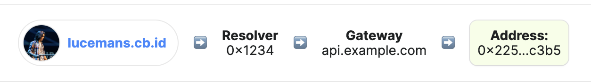

# Enclave
## Privacy preserving FHE enabled cross-chain ENS record system

Making use of Fhenix enabled contracts to encrypt private information and restrict the permission set who can read this data. These records are encrypted and stored in the same format as a regular ENS text record. This allows for seamlesss integration with existing infrastructure. The only necessary addition is decryption using tools from the fhenixjs library on the client side.

### Project Structure
`/src` - Solidity contracts  
`/test` - Foundry tests  
`/script` - Deployment scripts  
`/ens-gateway` - Typescript API Gateway  
`/util` - FHE Test Helpers/Mocks  

### Documentation Feedback : ENS
#### Cross-Chain Resolver
The cross-chain resolver flow is quite complicated and difficult to understand initially. Some of the documentation pages lack depth of information e.g. the following picture is helpful but doesn't mention which network each address belongs to. Which can be quite confusing if you are not too fmailair with ENS.

It would also be useful to mention who owns the parent domain e.g. 'cd.id' in this flow and how subdomains are derived from that. This will explain in a more detailed way how the mainnet resolver knows which information to expose in the offChainLookup error. Otherwise it can be misleading as to where this comes from.

#### ccip.tools
ccip.tools website would benefit from some helper icons to ensure the user is inputting properly formatted information. e.g. it is not very clear that the user must append /{sender}/{data}.json to the api gateway url. This could be autocompleted for the user or a warning icon could appear to remind the user to do this. If a user is deploying this to mainnet it could be quite expensive and it may not even work if not properly configured.